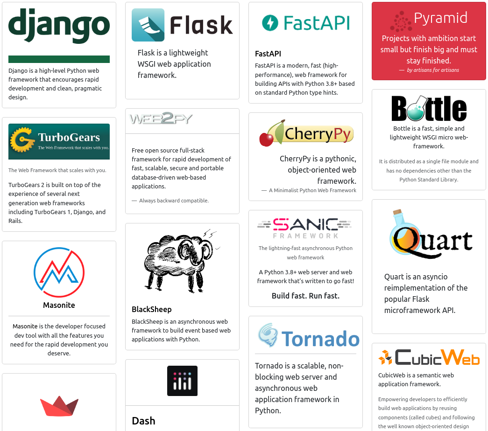

# Python Frameworks

A HTML page with curated list of Python frameworks!


[](https://pythonframeworks.com/)

[https://pythonframeworks.com/](https://pythonframeworks.com/)


## Contribution

### Step 1: Setup Development Environment

This project is built with [`bottle.py`](https://bottlepy.org/), fork and clone this repository, and run

```bash
$ python frameworks.py
```

Then visit `http://localhost:8080/`, there's no third-party dependencies.


### Step 2: Add a Bootstrap Card

Add a Bootstrap card element, like this:
```html
<div class="col-sm-6 col-lg-3 mb-4">
    <div class="card">
        ...
    </div>
</div>
```
The `card` element would include the `name`, `link`, `logo` and `description` of the framework. You can decarate it by using [Bootstrap Card Class](https://getbootstrap.com/docs/5.0/components/card/) with your preference.

If you need a new category of Python framework, then wrap the card like this:

```html

<hr class="my-4">

<h3 class="mt-5 display-6">Category Name</h3>
<p>Description of this category</p>

<div class="row mt-4" data-masonry='{"percentPosition": true }'>
    <div class="col-sm-6 col-lg-3 mb-4">
        <div class="card">
            ...
        </div>
    </div>
</div>
```


Review the updates at your local, if everything looks good, then create a pull request to the `main` branch here.


### Question

If you have any question about this opinionated list, do not hesitate to contact me [@jerrygubytes](https://twitter.com/jerrygubytes) on X (Twitter) or open an issue on GitHub.


### License

MIT
