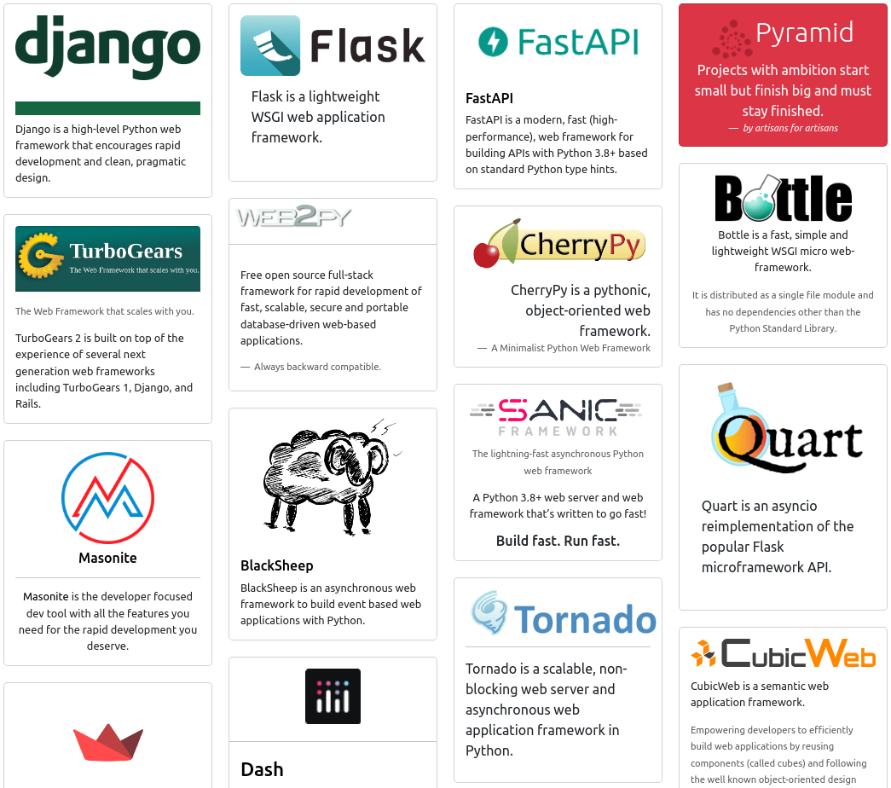

# Python Frameworks

A curated directory of popular Python frameworks, libraries, and tools — organized by category and published at **[pythonframeworks.com](https://pythonframeworks.com/)**.

[](https://pythonframeworks.com/)

---

## Project structure

```
index.html            # All site content (~4,500 lines)
frameworks.py         # Local dev server (Bottle.py, 16 lines)
llms.txt              # LLM/AI agent discovery file
static/
  css/                # Bootstrap 5
  js/                 # Masonry, ImagesLoaded
  image/
    logos/            # Framework logos (~190 files)
bottle.py             # Vendored single-file WSGI framework (do not edit)
```

---

## Categories

| Category | Description |
|---|---|
| Web Apps | Full-stack and WSGI/ASGI frameworks (Django, Flask, FastAPI, …) |
| Web APIs | REST and GraphQL API frameworks |
| CMS | Content management systems |
| ML, DL, and AI | Machine learning and deep learning frameworks |
| LLM, Gen-AI, and Agents | LLM orchestration and AI agent frameworks |
| Task Queue and Messaging | Distributed task queues and message brokers |
| Parallel and Distributed Computing | Parallel and distributed workload frameworks |
| Workflow and Pipelines | Workflow orchestration and data pipeline tools |
| Serverless | Python serverless and cloud-function frameworks |
| DevOps | Infrastructure automation and DevOps tools |
| Web Crawling and Scraping | Web scraping and crawling frameworks |
| GUI and TUI Apps | Desktop GUI and terminal UI frameworks |
| Games | Game development frameworks |
| Automated Testing | Testing and QA frameworks |
| Enterprise Integrations | Enterprise messaging and integration tools |

---

## Contributing

Contributions are welcome — new frameworks, updated logos, better descriptions, and bug fixes are all appreciated.

### 1. Set up the development environment

Requires Python 3. No extra dependencies beyond the vendored `bottle.py`.

```bash
git clone https://github.com/jgujerry/pythonframeworks.git
cd pythonframeworks
python3 frameworks.py
```

Visit [http://localhost:8080/](http://localhost:8080/). The server hot-reloads on file changes.

### 2. Add a framework

All content lives in `index.html`. Find the right category section (each is a `<div class="category" id="...">`) and add a Bootstrap card inside its `.row.grids` div. Use an existing card as a reference for structure and style.

### 3. Add a category

Add a new section before the closing `</main>` tag, following this pattern:

```html
<hr class="my-4">

<div class="category" id="Category Name">
    <h3 class="mt-5 display-6">Category Name</h3>
    <p>A short paragraph describing this category and why it matters.</p>

    <div class="row grids mt-4" data-masonry='{"percentPosition": true }'>
        <!-- cards go here -->
    </div>
</div>
```

The navigation tag cloud is generated automatically from `id` attributes — no manual nav updates needed.

### 4. Update `llms.txt`

If you add a new framework or category, also update `llms.txt` at the project root so AI agents and LLM-powered search tools stay accurate.

### 5. Open a pull request

- Test your changes locally at [http://localhost:8080/](http://localhost:8080/).
- Keep card descriptions concise and neutral — describe what the framework does, not marketing copy.
- One framework or related set of changes per PR keeps reviews fast.
- Target the `main` branch.

---

## Contact

Questions or suggestions? Open an issue on GitHub or reach out to [@jgujerry](https://twitter.com/jgujerry) on X (Twitter).

## License

Released under the [MIT License](LICENSE).
